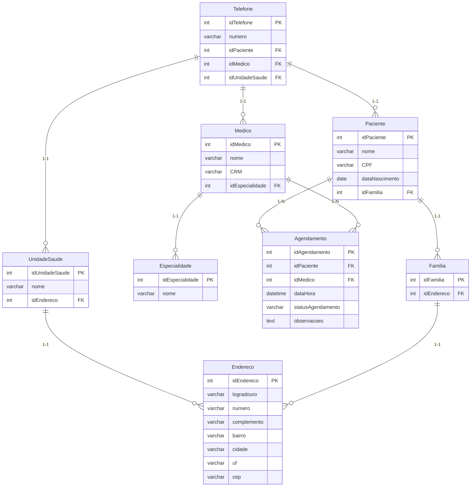
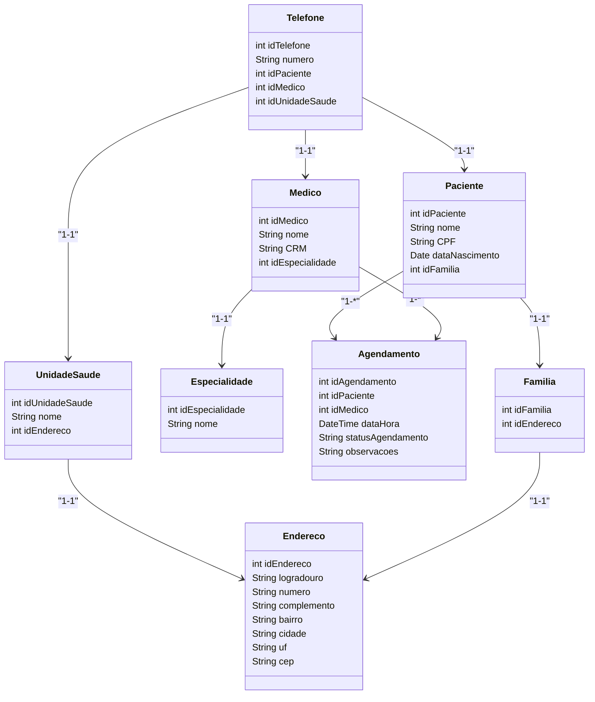

# Java-web-pi

## Banco de dados: 

```mermaid
erDiagram
    UnidadeSaude {
        int idUnidadeSaude PK
        varchar nome
        int idEndereco FK
    }

    Endereco {
        int idEndereco PK
        varchar logradouro
        varchar numero
        varchar complemento
        varchar bairro
        varchar cidade
        varchar uf
        varchar cep
    }

    Medico {
        int idMedico PK
        varchar nome
        varchar CRM
        int idEspecialidade FK
    }

    Especialidade {
        int idEspecialidade PK
        varchar nome
    }

    Telefone {
        int idTelefone PK
        varchar numero
        int idPaciente FK
        int idMedico FK
        int idUnidadeSaude FK
    }

    Paciente {
        int idPaciente PK
        varchar nome
        varchar CPF
        date dataNascimento
        int idFamilia FK
    }

    Agendamento {
        int idAgendamento PK
        int idPaciente FK
        int idMedico FK
        datetime dataHora
        varchar statusAgendamento
        text observacoes
    }

    Familia {
        int idFamilia PK
        int idEndereco FK
    }

    %% Relacionamentos

    UnidadeSaude ||--o{ Endereco : "1-1"
    Medico ||--o{ Especialidade : "1-1"
    Telefone ||--o{ Paciente : "1-1"
    Telefone ||--o{ Medico : "1-1"
    Telefone ||--o{ UnidadeSaude : "1-1"
    Paciente ||--o{ Familia : "1-1"
    Paciente ||--o{ Agendamento : "1-N"
    Medico ||--o{ Agendamento : "1-N"
    Familia ||--o{ Endereco : "1-1"


```

## Diagrama de Classe:

```mermaid
classDiagram
    class UnidadeSaude {
        int idUnidadeSaude
        String nome
        int idEndereco
    }
    
    class Endereco {
        int idEndereco
        String logradouro
        String numero
        String complemento
        String bairro
        String cidade
        String uf
        String cep
    }

    class Medico {
        int idMedico
        String nome
        String CRM
        int idEspecialidade
    }

    class Especialidade {
        int idEspecialidade
        String nome
    }

    class Telefone {
        int idTelefone
        String numero
        int idPaciente
        int idMedico
        int idUnidadeSaude
    }

    class Paciente {
        int idPaciente
        String nome
        String CPF
        Date dataNascimento
        int idFamilia
    }

    class Agendamento {
        int idAgendamento
        int idPaciente
        int idMedico
        DateTime dataHora
        String statusAgendamento
        String observacoes
    }

    class Familia {
        int idFamilia
        int idEndereco
    }

    %% Relações entre as entidades

    UnidadeSaude --> Endereco : "1-1" 
    Medico --> Especialidade : "1-1" 
    Telefone --> Paciente : "1-1" 
    Telefone --> Medico : "1-1" 
    Telefone --> UnidadeSaude : "1-1"
    Paciente --> Familia : "1-1"
    Paciente --> Agendamento : "1-*" 
    Medico --> Agendamento : "1-*"
    Familia --> Endereco : "1-1" 

    %% Comentários sobre as cardinalidades
    %% UnidadeSaude e Endereco têm uma relação de 1 para 1
    %% Médico e Especialidade têm uma relação de 1 para 1
    %% Paciente e Telefone têm uma relação de 1 para 1
    %% Médico e Telefone têm uma relação de 1 para 1
    %% Unidade de Saúde e Telefone têm uma relação de 1 para 1
    %% Paciente e Família têm uma relação de 1 para 1
    %% Paciente e Agendamento têm uma relação de 1 para muitos
    %% Médico e Agendamento têm uma relação de 1 para muitos
    %% Família e Endereço têm uma relação de 1 para 1


```
